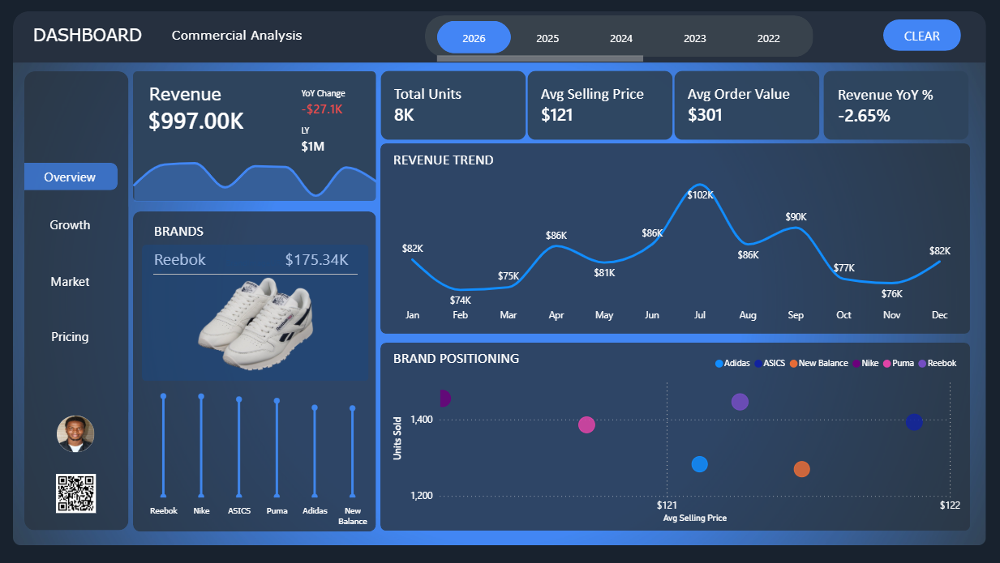
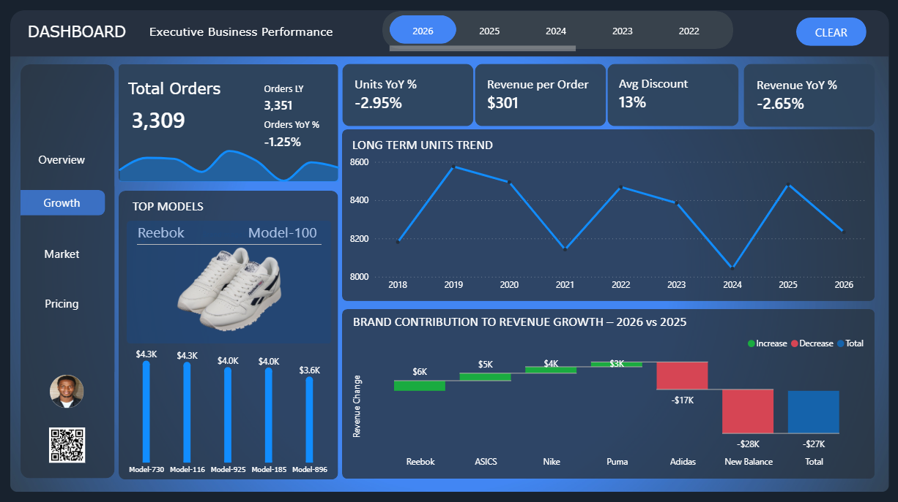
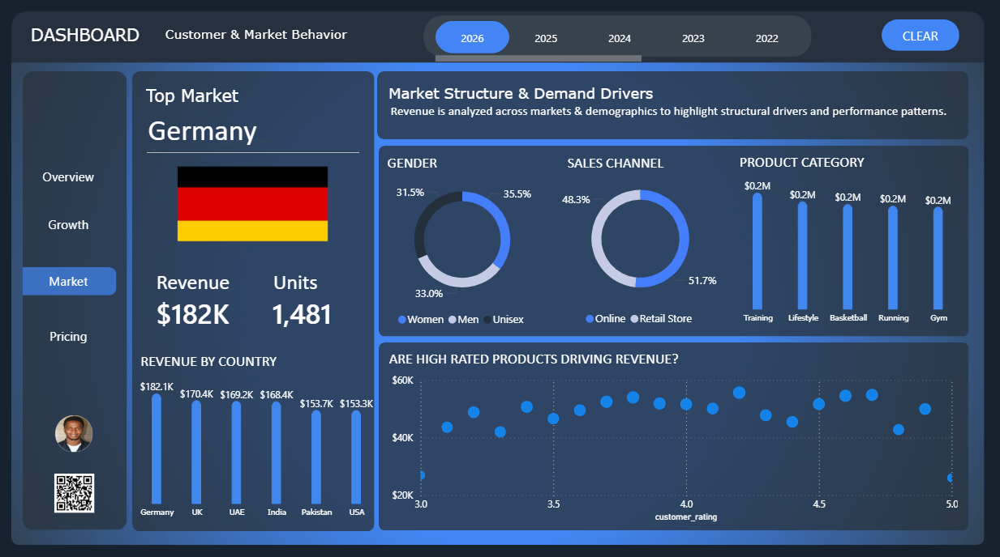
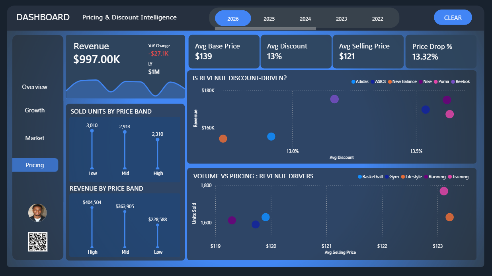

# 👟 Footwear Sales Analysis — From Flat Data to Business Insight

> *How converting a flat schema into a star schema changed everything about how this data tells its story.*

---

## 📌 Overview

A full commercial analytics project built on footwear sales data spanning **2018–2026**, covering six major brands across global markets.

What you see at the end is a clean, interactive Power BI dashboard.  
What you don't see is the structural work that had to happen first.

---

## 🖼️ Dashboard Preview

| Overview | Growth |
|----------|--------|
|  |  |

| Market | Pricing |
|--------|---------|
|  |  |

---

## 🧠 The Problem — Flat Data, No Clarity

The raw dataset was a single flat table with everything packed together:

- No clear relationships between dimensions and facts  
- No separation between orders, products, customers, and markets  
- Hard to build reliable year-on-year metrics  
- Business logic was nearly impossible to express cleanly in DAX  

**Solution:** Restructure the flat table into a proper **star schema** — fact table at the center, clean dimension tables around it — to make sales operations clearer and analytics easier to build.

---

## 🔍 Key Business Questions

Once the model made sense, the real analysis started:

- What was driving year-on-year revenue growth?  
- Was revenue **volume-driven** or **price-driven**?  
- How did different markets and demographics affect performance?  
- Did discount strategies across brands actually increase revenue?  
- Which brands contributed positively or negatively to growth?

---

## 📊 Dashboard Pages

### 1. Commercial Overview
- Total revenue: **$997K** (YoY: -2.65%)
- Avg selling price: **$121** | Avg order value: **$301**
- Monthly revenue trend across the full year
- Brand positioning matrix (units vs. avg price)
- **Top brand: Reebok** at $175.34K

### 2. Executive Business Performance (Growth)
- Year-on-year unit and revenue growth tracking
- Long-term units trend (2018–2026)
- Brand contribution to revenue growth — waterfall chart
- Top models by sales performance
- **Key insight:** New Balance (-$28K) and Adidas (-$17K) dragged total growth down despite positive contributions from Reebok, ASICS, Nike, and Puma

### 3. Customer & Market Behavior
- **Top market: Germany** — $182K revenue, 1,481 units
- Revenue by country: Germany, UK, UAE, India, Pakistan, USA
- Gender split: Women (35.5%), Men (33%), Unisex (31.5%)
- Channel split: Retail Store (51.7%) vs. Online (48.3%)
- Product categories: Training, Lifestyle, Basketball, Running, Gym
- Rating vs. revenue scatter — high ratings don't clearly dominate revenue

### 4. Pricing & Discount Intelligence
- Avg base price: **$139** | Avg discount: **13%** | Price drop: **13.32%**
- Units by price band: Low (3,010), Mid (2,913), High (2,310)
- Revenue by price band: High ($404K) > Mid ($363K) > Low ($228K)
- Discount behavior by brand — is revenue discount-driven?
- Volume vs. pricing by product category

---

## 🛠️ Tools & Tech

| Tool | Usage |
|------|-------|
| **Power BI** | Dashboard design, DAX measures, data modeling |
| **Power Query** | Data transformation and schema restructuring |
| **DAX** | Year-on-year metrics, contribution to growth, KPIs |
| **Star Schema** | Fact + dimension table modeling |
| **Excel** | Raw data source |

---

## 📐 Data Model

The flat table was broken into a star schema with:

- **Fact Table:** Sales transactions (revenue, units, discount, order ID)
- **Dim Tables:** Product, Brand, Country/Market, Date, Customer/Gender, Channel

This separation made DAX formulas cleaner and business logic traceable.

---

## 📉 DAX Challenges — The Honest Part

This project humbled me.

Building clean DAX that truly reflected the business logic was harder than expected:
- Year-on-year comparisons with `SAMEPERIODLASTYEAR`
- Contribution to growth calculations
- Separating volume effects from price effects

I realized there were business analytics concepts I wasn't fully comfortable with.  
This project forced me to slow down and grow in that area.

---

## 🎨 Design

The layout was inspired by **Bas Dohmen** (How to Power BI).

- Dark theme with a consistent blue accent palette  
- Dynamic KPI cards with YoY change indicators  
- Clean navigation sidebar  
- Charts chosen for the business question they answer, not for aesthetics alone  

---

## 💡 Key Insights

1. **Revenue is high-price-band driven** — high-band products generate the most revenue despite lower unit volume
2. **Retail still edges online** — 51.7% of sales still go through physical stores
3. **Discount rates are nearly uniform** — brands cluster around 13%, meaning discount is not a differentiator
4. **Germany is the strongest market** — outperforming UK, UAE, India, Pakistan, and USA
5. **Growth drag is brand-specific** — New Balance and Adidas pulled the 2026 total negative despite other brands growing

---

## 🗂️ Repository Structure

```
footwear-sales-analysis/
│
├── README.md
├── Footwear_Sales_Report.pbix       # Power BI file
├── Footwear_sales_report.docx       # Project documentation
├── data/
│   └── footwear_sales_flat.xlsx     # Raw source data
└── screenshots/
    ├── Overview.png
    ├── Growth.png
    ├── Market.png
    └── pricing.png
```

---

## 👤 Author

**Umar** — Data Analytics Professional    

---

*Flat data → Structured model → Clear metrics → Business insight*
